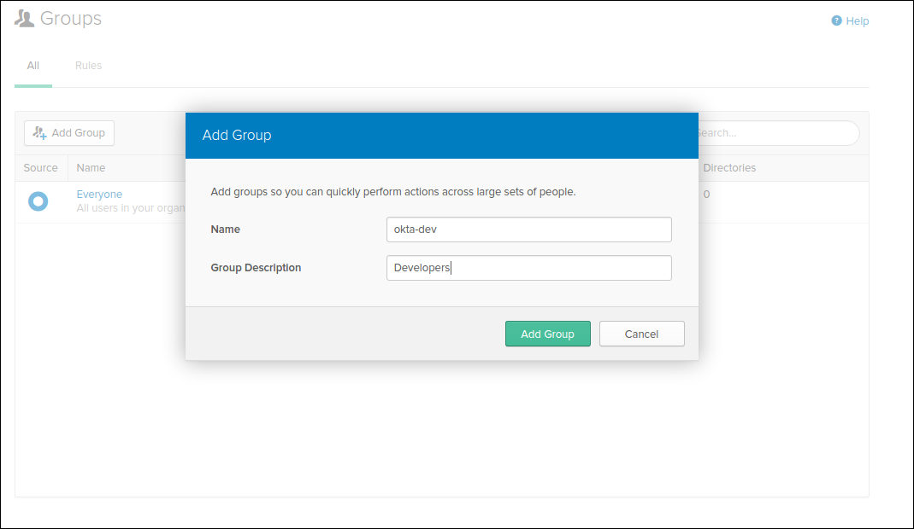
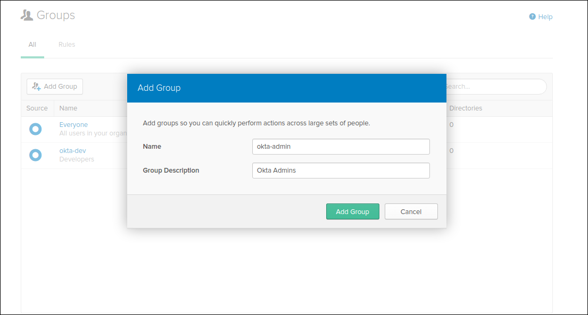
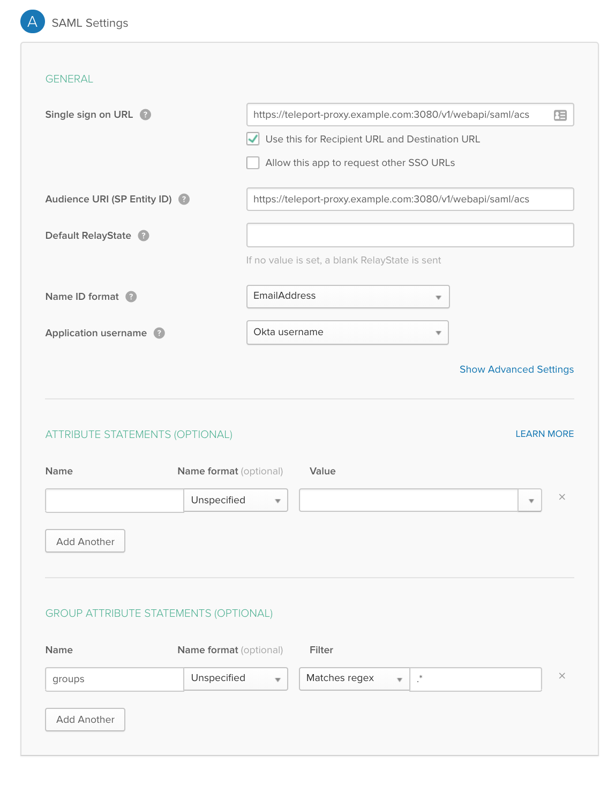
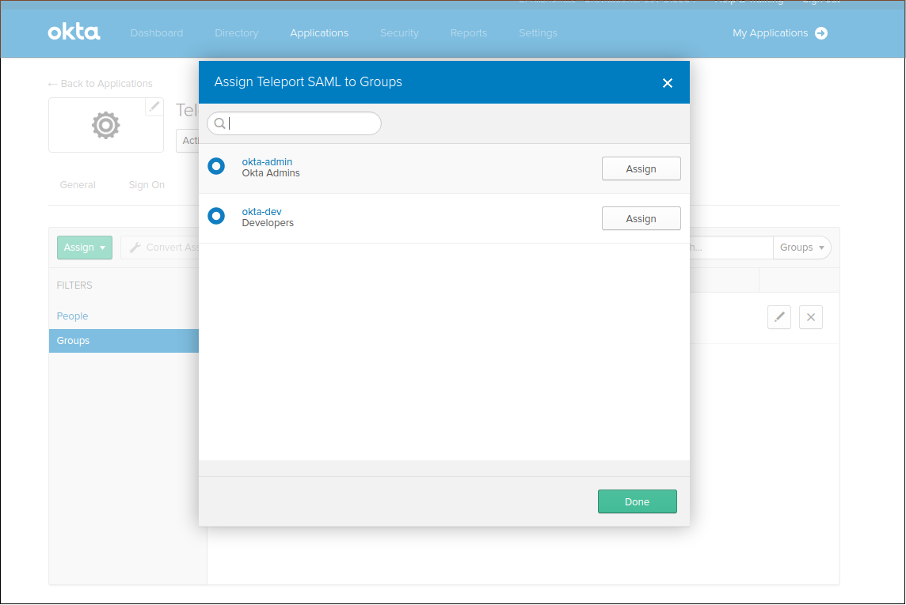

# SAML 2.0 Features

Teleport Enterprise supports SAML 2.0 as an external identity provider and has been
tested to work with Okta and Active Directory Federation Services (ADFS)
2016.

## Okta

This guide configures Okta map groups via SAML to Teleport roles.

### Start Teleport

Start Teleport with this samle config, notice how we set `dynamic_config: true` to indicate that we will use dynamic configuration
as opposed to static file config.

```yaml
# Simple config file with just a few customizations (with comments)
teleport:
  nodename: localhost
  log:
    output: stderr
    severity: DEBUG
  dynamic_config: true
auth_service:
  enabled: yes
  cluster_name: teleport.local
ssh_service:
  enabled: yes
```

### Configure Okta

#### Create App

Create SAML 2.0 Web App in Okta config section


#### Configure Okta App

**Create Groups**

We are going to create groups `okta-dev` and `okta-admin`:

**Devs**



**Admins**



**Configure APP**

We are going to map these Okta groups to SAML Attribute statements (special signed metadata
exposed via SAML XML response).

GENERAL

- Single sign on URL `https://teleport-proxy.example.com:3080/v1/webapi/saml/acs`

- Audience URI (SP Entity ID)`https://teleport-proxy.example.com:3080/v1/webapi/saml/acs`

- Name ID format `EmailAddress`

- Application username `Okta username`

GROUP ATTRIBUTE STATEMENTS

- Name: `groups` | Name format: `Unspecified`

-  Filter: `Matches regex` |  `.*`



**Notice:** We have set NameID to email format and mappped groups with wildcard regex in Group Attribute statements.
We have also set Audience and SSO url to be the same thing.

**Assign Groups**

Assign groups and people to your SAML app:




#### Configure Teleport SAML 


Download metadata in the form of XML doc, we will use it to configure Teleport.

```
kind: saml
version: v2
metadata:
  name: OktaSAML
spec:
  acs: https://localhost:3080/v1/webapi/saml/acs
  attributes_to_roles:
    - {name: "groups", value: "okta-admin", roles: ["admin"]}
    - {name: "groups", value: "okta-dev", roles: ["dev"]}
  entity_descriptor: |
    <paste SAML XML contents here>
```

Configure the SAML by creating configuration resource in teleport using `tctl` command:

```bash
tctl create -f saml.yaml
```

Create file `preference.yaml` that will configure teleport to use SAML as primary configuration method:

```saml
kind: cluster_auth_preference
version: v2
metadata:
  name: "cluster-auth-preference"
spec:
  type: saml
```

```bash
tctl create -f preference.yaml
```

#### Create Teleport Roles

We are going to create 2 roles, privileged role admin who is able to login as root and is capable
of administrating the cluster and non-privileged dev who is only allowed to view sessions and login as non-privileged user.

```yaml
kind: role
version: v2
metadata:
  name: admin
  namespace: default
spec:
  logins: [root]
  max_session_ttl: 90h0m0s
  namespaces: ['*']
  node_labels:
    '*': '*'
  resources:
    '*': [read, write]
```

Devs are only allowed to login to nodes labelled with `access: relaxed` teleport label.

```yaml
kind: role
version: v2
metadata:
  name: stage-devops
spec:
  logins: [ubuntu]
  max_session_ttl: 90h0m0s
  namespaces: ['*']
  node_labels:
    access: relaxed
  resources:
    '*': [read]
```
    

**Notice:** Replace `ubuntu` with linux login available on your servers!

```bash
tctl create -f admin.yaml
tctl create -f dev.yaml
```

### Login

For the Web UI, if the above configuration were real, you would see a button
that says `Login with Okta`. Simply click on that and you will be
re-directed to a login page for your identity provider and if successful,
redirected back to Teleport.

For console login, you simple type `tsh --proxy <proxy-addr> ssh <server-addr>`
and a browser window should automatically open taking you to the login page for
your identity provider. `tsh` will also output a link the login page of the
identity provider if you are not automatically redirected.

!!! note "IMPORTANT":
    Teleport only supports sending party initiated flows for SAML 2.0. This
    means you can not initiate login from your identity provider, you have to
    initiate login from either the Teleport Web UI or CLI.

## ADFS

### ADFS Configuration

You'll need to configure ADFS to export claims about a user (Claims Provider
Trust in ADFS terminology) and you'll need to configure AD FS to trust
Teleport (a Relying Party Trust in ADFS terminology).

For Claims Provider Trust configuration you'll need to specify at least the
following two incoming claims: `Name ID` and `Group`. `Name ID` should be a
mapping of the LDAP Attribute `E-Mail-Addresses` to `Name ID`. A group
membership claim should be used to map users to roles (for example to
separate normal users and admins).


In addition if you are using dynamic roles (see below), it may be useful to map
the LDAP Attribute `SAM-Account-Name` to `Windows account name` and create
another mapping of `E-Mail-Addresses` to `UPN`.


You'll also need to create a Relying Party Trust, use the below information to
help guide you through the Wizard. Note, for development purposes we recommend
using `https://localhost:3080/v1/webapi/saml/acs` as the Assertion Consumer
Service (ACS) URL, but for production you'll want to change this to a domain
that can be accessed by other users as well.

* Create a claims aware trust.
* Enter data about the relying party manually.
* Set the display name to something along the lines of "Teleport".
* Skip the token encryption certificate.
* Select `Enable support for SAML 2.0 Web SSO protocol` and set the URL to `https://localhost:3080/v1/webapi/saml/acs`.
* Set the relying party trust identifier to `https://localhost:3080/v1/webapi/saml/acs` as well.
* For access control policy select `Permit everyone`.

Once the Relying Party Trust has been created, update the Claim Issuance Policy
for it. Like before make sure you send at least `Name ID` and `Group` claims to the
relying party (Teleport). If you are using dynamic roles, it may be useful to
map the LDAP Attribute `SAM-Account-Name` to `Windows account name` and create
another mapping of `E-Mail-Addresses` to `UPN`.

Lastly, ensure the user you create in Active Directory has an email address
associated with it. To check this open Server Manager then
`Tools -> Active Directory Users and Computers` and select the user and right
click and open properties. Make sure the email address field is filled out.

### Teleport Configuration

Teleport can be configured with static or dynamic roles. Static roles are simple
and great when the role you need to associate with a user is static. If the role
your user assumes depends on the attributes that you send along, consider using
dynamic roles.

#### Static Roles

To configure Teleport with static roles, first you'll need to create at least
the following two roles. One is for an admins and the other is for a normal
users. You can create them on the backend using `tctl create -f {file name}`.

```yaml
kind: role
version: v2
metadata:
   name: "admins"
   namespace: "default"
spec:
   namespaces: [ "*" ]
   max_session_ttl: 90h0m0s
   logins: [ root ]
   node_labels:
      "*": "*"
   resources:
      "*": [ "read", "write" ]
```
```yaml
kind: role
version: v2
metadata:
   name: "users"
   namespace: "default"
spec:
   max_session_ttl: 90h0m0s
   logins: [ root, jsmith ]
```

Next create a SAML resource, once again you can do this with `tctl create -f {file name}`.

```yaml
kind: saml
version: v2
metadata:
  name: "adfs"
  namespace: "default"
spec:
  provider: "adfs"
  acs: "https://localhost:3080/v1/webapi/saml/acs"
  entity_descriptor_url: "https://adfs.example.com/FederationMetadata/2007-06/FederationMetadata.xml"
  attributes_to_roles:
    - name: "http://schemas.xmlsoap.org/claims/Group"
      value: "teleadmins"
      roles: ["admins"]
    - name: "http://schemas.xmlsoap.org/claims/Group"
      value: "teleusers"
      roles: ["users"]
```

The `acs` field should match the value you set in ADFS earlier and you can
obtain the `entity_descriptor_url` from ADFS under
`AD FS -> Service -> Endpoints -> Metadata`.

The `attributes_to_roles` is used to map attributes to the Teleport roles you
just creataed. In our situation, we are mapping the `Group` attribute whose full
name is `http://schemas.xmlsoap.org/claims/Group` with a value of `teleadmins`
to the `admin` role. Groups with the value `teleusers` is being mapped to the
`users` role.

#### Dynamic Roles

Static roles are simple to understand and use, but can be cumbersome in certain
situation. For example if every user has a seperate login stead of a shared
login, you have to create/remote a new role every time someone joins (or leaves)
the company. In this situation you can use role templates to dynamically create
roles based off information passed in the assertions.

```yaml
kind: saml
version: v2
metadata:
  name: "adfs"
  namespace: "default"
spec:
  provider: "adfs"
  acs: "https://localhost:3080/v1/webapi/saml/acs"
  entity_descriptor_url: "https://adfs.example.com/FederationMetadata/2007-06/FederationMetadata.xml"
  attributes_to_roles:
     - name: "http://schemas.xmlsoap.org/claims/Group"
       value: "teleadmins"
       role_template:
          kind: role
          version: v2
          metadata:
             name: '{{index . "http://schemas.xmlsoap.org/ws/2005/05/identity/claims/upn"}}'
             namespace: "default"
          spec:
             namespaces: [ "*" ]
             max_session_ttl: 90h0m0s
             logins: [ '{{index . "http://schemas.microsoft.com/ws/2008/06/identity/claims/windowsaccountname"}}', root ]
             node_labels:
                "*": "*"
             resources:
                "*": [ "read", "write" ]
     - name: "http://schemas.xmlsoap.org/claims/Group"
       value: "teleusers"
       role_template:
          kind: role
          version: v2
          metadata:
             name: '{{index . "http://schemas.xmlsoap.org/ws/2005/05/identity/claims/upn"}}'
             namespace: "default"
          spec:
             max_session_ttl: 90h0m0s
             logins: [ '{{index . "http://schemas.microsoft.com/ws/2008/06/identity/claims/windowsaccountname"}}', root ]
```

The `attributes_to_roles` field is the same as static roles except instead of
`roles` we have `role_template` which defines the role to be created when the
user successfully logs in. Note that the login and role name are extracted from
the additional assertions we created above and injected into the role.

The last resource you'll need to configure for Teleport is your cluster
authentication preferences. Once again create the below resource with
`tctl create -f {file name}`.

```yaml
kind: cluster_auth_preference
version: v2
metadata:
  description: ""
  name: "cluster-auth-preference"
  namespace: "default"
spec:
  type: saml
```

### Exporting Signing Key

For the last step, you'll need to export the signing key, you can do this with
`tctl saml export --name adfs`. Save the output to a file named `saml.crt`.
Return back to AD FS and open the Relying Party Trust and add this file as one
of the signature verification certificates.

### Login

For the Web UI, if the above configuration were real, you would see a button
that says `Login with adfs`. Simply click on that and you will be
re-directed to a login page for your identity provider and if successful,
redirected back to Teleport.

For console login, you simple type `tsh --proxy <proxy-addr> ssh <server-addr>`
and a browser window should automatically open taking you to the login page for
your identity provider. `tsh` will also output a link the login page of the
identity provider if you are not automatically redirected.
